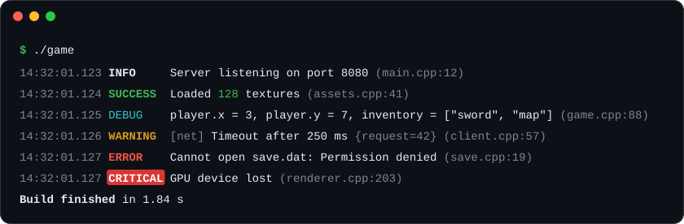

<div align="center">

# Gem Logger

**A single-header C++23 logger: simple to use, complete when you need it.**

[](https://en.cppreference.com/w/cpp/23)
[](logger.h)
[](LICENSE)



</div>

## Get started

Copy [`logger.h`](logger.h) into your project and include it. There is nothing to set up: your logs go straight
to a colored console.

```cpp
#include "logger.h"

int main() {
    LOG_INFO("Server listening on port {}", 8080);
    LOG_SUCCESS("Loaded <green>{}</green> textures", 128);
    LOG_ERROR("Cannot open {}", "save.dat");
}
```

Compile in C++23: `/std:c++latest /utf-8` with MSVC, `-std=c++23` with GCC or Clang.

## Why Gem Logger

- **Safe.** Messages use `std::format`, so a wrong format string does not compile.
- **Ready.** Levels, colors, time, file and line from the first include, on Windows too.
- **Open to anything.** Containers, exceptions, paths, enums, or any type with an `operator<<`.
- **Reliable.** Thread-safe, it never throws, and the last lines before a crash reach the disk.
- **Fast.** In async mode, a log costs the caller about half a microsecond.

## A quick tour

```cpp
// See your variables
LOG_DUMP(player.x, player.y, inventory);   // player.x = 3, player.y = 7, inventory = ["sword", "map"]

// Print with colors, in order with the logs
Gem::println("<bold>Build finished</bold> in {:.2f} s", seconds);

// Measure, add context, avoid spam
LOG_TIMER("load level");                        // load level: 12.48 ms, when the scope ends
LOG_CONTEXT("request", id);                     // {request=42} on every log of this scope
LOG_WARNING_ONCE("Texture {} missing", name);   // once, even inside a loop

// Name your subsystems
Gem::Log::Channel net{"net"};
net.warning("Timeout after {} ms", 250);        // WARNING  [net] Timeout after 250 ms

// Send your logs anywhere
Gem::Log::add_file("logs/app.log");                     // rotated at 10 MB, 5 files kept
Gem::Log::add_file("logs/app.jsonl", {.json = true});   // JSON Lines
Gem::Log::add_callback([](auto&, std::string_view line) { overlay.add(line); });

// Tune it
Gem::Log::set_level(Gem::Log::Level::Warning);   // hide what is below
Gem::Log::set_async(true);                       // write from a background thread
```

## Make it yours

Every line follows a pattern, and patterns understand color tags:

```cpp
Gem::Log::set_pattern("<dim>%(time)</dim> <level>%(level:<8)</level> %(message)");
```

The [guide](docs/guide.md) covers patterns, colors, sinks, filters, async options and every other setting.

## License

[MIT](LICENSE) © jedreety
